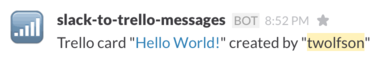

slack-to-trello
===============

.. image:: https://travis-ci.org/underdogio/slack-to-trello.png?branch=master
   :target: https://travis-ci.org/underdogio/slack-to-trello
   :alt: Build Status

Perform Trello actions via slash commands in Slack

The current iteration is a proof of concept; only 1 Slack team, 1 Trello user, and 1 Trello list is supported at the moment. In the future, we would like to support multiple teams and boards via an OAuth integration with Trello (to connect Slack users to Trello users) and some mechanism to select board (either from Slack or a mapping on the server).

Convert

into

Getting Started
---------------
To get a copy of ``slack-to-trello`` running, please follow the steps below:

.. code:: bash

    # Clone our repository
    git clone https://github.com/underdogio/slack-to-trello
    cd slack-to-trello/

    # Install our dependencies
    pip install -r requirements.txt

    # Install our module as a dependency of itself (meta)
    python setup.py develop

    # The remaining steps are for setting up our configuration
    # We will be building `slack_to_trello/config/env`
    # We start by copying `env.test`
    cp slack_to_trello/config/env.test slack_to_trello/config/env

    # Create 2 Slack integrations (1 for receiving slash commands, 1 for sending messages)
    # First Slack integration: Slash Commands
    #   Open your browser to Slash Commands
    #   https://my.slack.com/services/new/slash-commands
    #   Command: "/trello"
    #   URL: "https://my-server/slack/message"
    #     Please replace `my-server` with your server location
    #     Don't forget to host it on HTTPS
    #   Method: "POST"
    #   Token: Provided by Slack
    #   Autocomplete -> Description: "Add a Trello card on the Engineering board"
    #   Autocomplete -> Help text: "[card subject]"
    #   Descriptive Label: "slack-to-trello"
    #   Click "Save Integration"

    # Once saved, add the "Token" field as `SLACK_TOKEN` into `env`
    #   `export SLACK_TOKEN=token_from_slack`

    # Second Slack integration: Incoming WebHooks
    #   These will be replies upon successful Trello card additions
    #   Open your browser to Incoming WebHooks
    #   https://my.slack.com/services/new/incoming-webhook
    #   Post to Channel: Pick any channel -- we will always be overriding this
    #   Webhook URL: Provided by Slack
    #   Descriptive Label: "slack-to-trello messages"
    #   Customize Name: "slack-to-trello"
    #   Customize Icon: Pick any you like -- we recommend `:signal_strength:`
    #   Click "Save Settings"

    # Once saved, add the "Webhook URL" field as `SLACK_MESSAGE_URL` into `env`
    #   `export SLACK_MESSAGE_URL=https://hooks.slack.com/services/path/to/reply`

    # Set up our Trello integration
    #   We recommend creating a bot user as all cards
    #   will be marked as "Created by" the chosen user

    # Collect our Trello API information
    #   Open our browser to https://trello.com/app-key
    #   Save "Key" as `TRELLO_API_KEY` in `env`
    #   `export TRELLO_API_KEY=value_from_key`

    # Generate a permanent Trello API token (this can be disabled later on)
    #   Using the "Key" as "TRELLO_API_KEY" and "Secret" as "TRELLO_API_SECRET"
    TRELLO_API_KEY=key_from_website TRELLO_API_SECRET=secret_from_website bin/generate-trello-tokens.py
    #   You will be prompted to open a link
    #   Follow the link and click "Accept"
    #   Copy the standalone value from the page
    #   Go back to the command line and enter "y"
    #   You will be prompted for a PIN
    #   Paste the value from the page
    #   You will be given an `oauth_token` and `oauth_token_secret` value

    # Save `oauth_token` as `TRELLO_TOKEN` in `env`
    #   `export TRELLO_TOKEN=value_from_oauth_token`

    # Find the board/list we want to add cards to
    # List our boards and their ids via:
    bin/list-trello-boards.py [TRELLO_API_KEY] [TRELLO_TOKEN]
    # Find the board we want and record its id as `TRELLO_BOARD_ID` in `env`
    #   `export TRELLO_BOARD_ID=target_board_id`

    # Output the board lists and their ids via:
    bin/list-trello-board-lists.py [TRELLO_API_KEY] [TRELLO_TOKEN] [TRELLO_BOARD_ID]
    # Find the list we want and record its id as `TRELLO_LIST_ID` in `env`
    #   `export TRELLO_LIST_ID=target_board_id`

    # Start our server (default port is 5000)
    ./run.sh
    # An alternative port can be chosen via the `PORT` environment variable
    # PORT=6000 ./run.sh

    # You should now be able to send a `/trello` command in Slack

Documentation
-------------
Testing
^^^^^^^
Our tests are powered via ``nosetests`` but require specific environment variables to be set up before hand. To run our tests, follow the steps below:

.. code:: bash

    # Install our development dependencies
    pip install -r requirements-dev.txt

    # Run our tests
    ./test.sh

Contributing
------------
In lieu of a formal styleguide, take care to maintain the existing coding style. Add unit tests for any new or changed functionality. Test via ``./test.sh``.

License
-------
Copyright (c) 2015 Underdog.io

Licensed under the MIT license.
